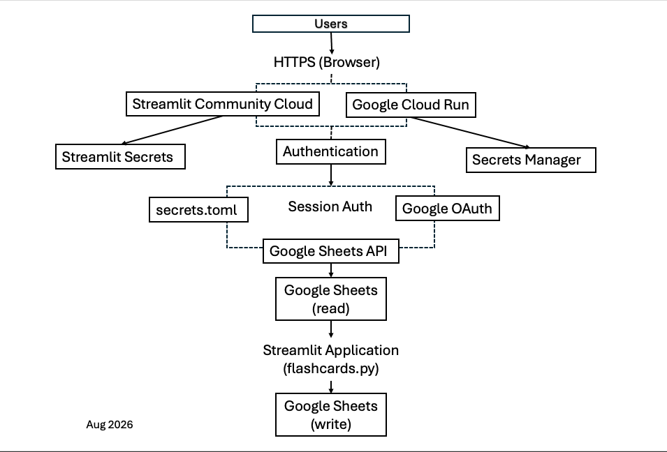

# Flashcards App

This app was created by Lori Jackson because she is too cheap to pay for
an app for flashcards.
It is currently deployed in two locations:
1) On streamlit https://phatboybobflashcards.streamlit.app/
2) On GCP: https://flashcards-1085737536907.us-east1.run.app/

## Functionality
This app is a flashcard app that shows a word in one language and checks if the user
correctly identified the translation. This app was originally created to
help Lori learn German, so though it works for any language, the text
is currently centered around German/English Translations.

This app has two directional Options
1) German to English
This option will display a word in German and request the English translation.
The user must type the correct answer exactly as it appears in the database
in order for that word to be counted as "correct" (trailing spaces are ok).
If the user correctly types a translation, the word will not come up again in that session*.
If the users incorrectly types the translation, the word will be put back into the queue,
and the word will be asked again until a correct translation is given.
The session will not finish until the user correctly types the translation for all words in the queue.
Once a user correctly types the translation of all words in the queue, the session ends and
the statistics for the words from that session are added to the database.
*More on "sessions" later.

2) English to German
Since most keyboards lack certain German characters, this option is more similar to
standard flashcards; a word is displayed on the screen, the user must say to themself
the translation. The user then reveals the translation and checks "yes" or "no" to the
question "did you get it right?"
Similar to German to English above, once all words in a session are marked as "correct"
the session will end and the statistics will be written to the databse.

## Sessions
A session represents the words to be asked.
Session parameters are set before "running" a session.
These parameters are as follows:
1) Number of words to ask
This is the number of words to ask in a session. I find that too many
or too few leads to poor retention. 10 is about the sweet-spot for me
2) Only Show if correct less than
This is a filter. It allows the user to only see words that have been
*asked* a total number of times *less than* the value displayed. For example:
New words that the user just added.
3) % right less than
This is a filter. It allows the user to only see words that have
been *correctly answered* a total percentage *less than* the value displayed.
This is good for words that have been asked 100 times, but only get answered correclty
50% of the time.

These parameters define a session. That session creates a queue of words that fit
the above parameters. The session does not end until all words have been
correctly answered. Once the session ends, the words are written to a database.

## Parameter Examples
* I added 20 new words the database that currently contains 1000 words.
I want to practice those 20 words until each word has been asked at least 5 times.
But I don't ever want more then 10 total words to be asked in a session.

To do this, the parameters will be
Number of words to ask: 10
Only show if correct less than: 6
% right less than: 101%

I will then re-run with the same parameters until the system notifies
me that I need to re-set the parameters to continue. Note: 10 will be
the maximum number of words.

* I didn't add any new words, I just want to practice all words
that I'm struggling with. Don't ask more than 15 words per session.

To do this, the parameters will be
Number of words to ask: 15
Only show if correct less than: 10000
% right less than: 75%

This will display 15 words that have a 75% accuracy rate.
The "1000" just has to be a number higher than the highest
number of times a word has been asked to assure all words
are included in the sample. If that number were 5, for example,
it would skip words that have been asked 20 times, but you've gotten
wrong 19 times.

## Below is an architecture diagram
